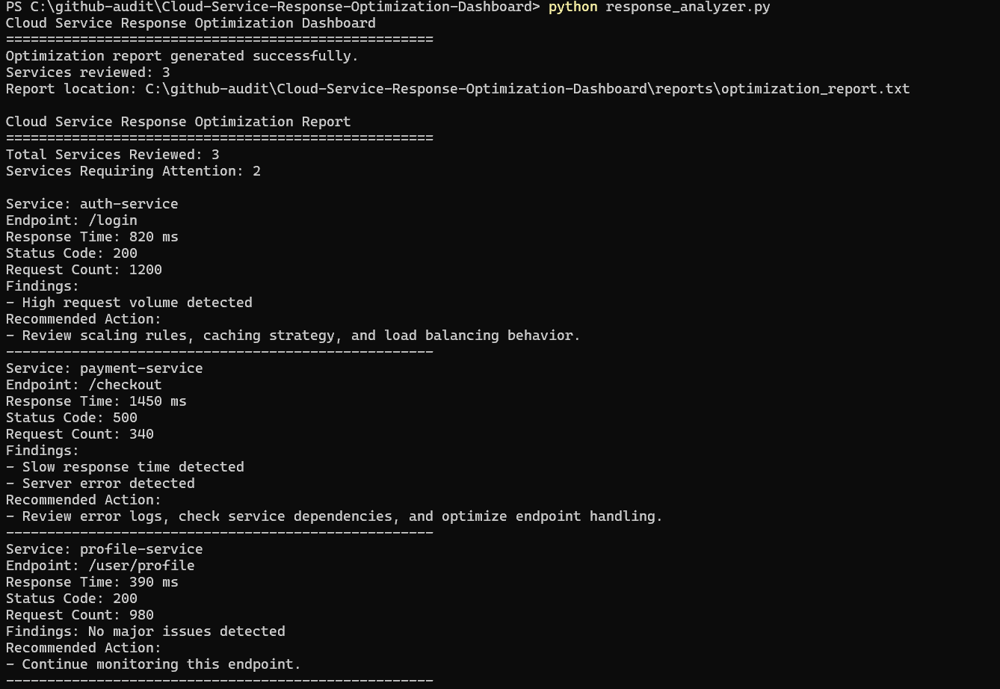

# Cloud Service Response Optimization Dashboard

## Overview

This project simulates a cloud support workflow for reviewing service response data, identifying performance concerns, and generating optimization recommendations.

It is designed to reflect how cloud support engineers investigate slow endpoints, service errors, and high request volume in production-like systems.

---

## Project Objective

To analyze simulated cloud service response logs and identify areas requiring performance review or operational attention.

The system focuses on:

- Service Response Time Analysis
- Endpoint Performance Review
- Error Status Detection
- High-Volume Request Identification
- Support-Style Optimization Reporting

---

## Simulated Environment

- Multiple Cloud-Hosted Backend Services
- API Endpoints Receiving User Requests
- Response Time And Status Code Logs
- Support Engineer Reviewing Service Health
- Generated Optimization Report For Escalation Or Review

---

## Incident Scenario

A cloud-hosted application is experiencing inconsistent performance.

Some users report slow page loading and failed requests. The support engineer reviews service response data to identify which endpoints need attention.

---

## System Architecture

```text
Data Layer
        |
        v
JSON Service Response Logs
        |
        v
Analysis Layer
        |
        v
Python Response Analyzer
        |
        v
Rules Layer
        |
        v
Threshold-Based Issue Detection
        |
        v
Reporting Layer
        |
        v
Generated Optimization Report
        |
        v
Evidence Layer
        |
        v
Screenshots And Report Output
` 

---

## Optimization Report Preview

The screenshot below shows the response analyzer reviewing simulated cloud service logs, identifying affected services, and generating optimization recommendations.




